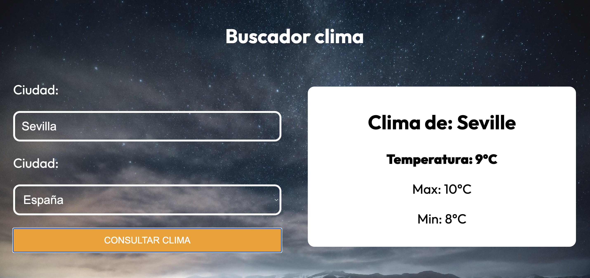

# ☁️ Aplicación del Clima 🌦️

Este proyecto de aprendizaje en **React** consume una API del clima utilizando **Axios** y está desarrollado con **TypeScript**. Durante su desarrollo, he explorado diferentes formas de tipar datos en TypeScript, incluyendo:

- **Casteo al tipo**
- **Type Guards**
- **Zod** (mi opción preferida)
- **Valibot** (más modular, pero menos intuitivo en algunos casos)

Además, he añadido un **spinner de carga** de [SpinKit](https://tobiasahlin.com/spinkit/) para mejorar la experiencia del usuario.

## 🚀 Demo del Proyecto
🔗 [Ver proyecto desplegado](https://juli-clima-api.netlify.app)

## 🛠️ Tecnologías Utilizadas
- **React** ⚛️
- **TypeScript**
- **Axios** (para consumir la API)
- **Zod** y **Valibot** (para validación de datos)
- **SpinKit** (spinner de carga)
- **CSS** para estilos

## 📌 Características
✔️ Consumo de una API del clima con Axios  
✔️ Varias estrategias de tipado con TypeScript  
✔️ Validación de datos con Zod y Valibot  
✔️ Spinner de carga para mejorar la UX  

## 📷 Captura de Pantalla

